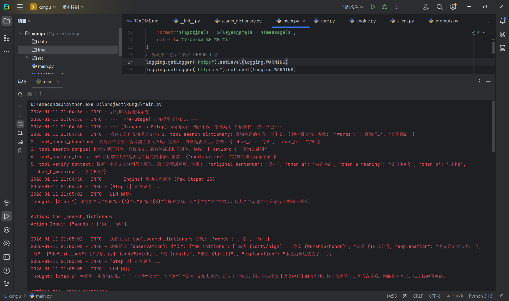
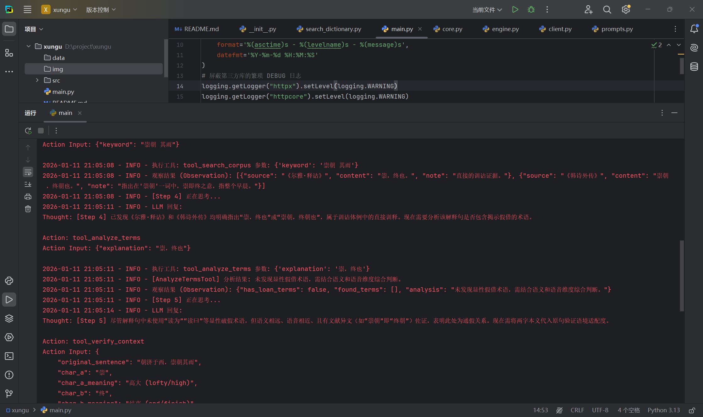
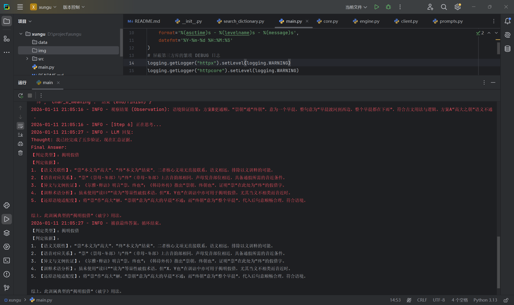

# 训诂智能体 (Xungu Intelligent Agent)

本项目实现了一个基于 **ReAct (Reasoning + Acting)** 模式的垂直领域智能体，利用大语言模型（LLM）作为推理核心，结合专业工具链，实现了从“自然语言输入”到“专业训诂报告”的全自动化流程。

## 环境准备与运行

1. **配置环境变量**
   请确保设置了 `DASHSCOPE_API_KEY` 环境变量，以便程序能够访问大模型服务。

2. **安装依赖**
   项目主要依赖 `openai` 库进行 LLM 调用。
   ```bash
   pip install openai
   ```

3. **运行项目**
   直接执行入口脚本即可启动诊断流程：
   ```bash
   python main.py
   ```
   *提示：可以通过修改 `main.py` 中的 `logging.basicConfig` 来调整日志级别（如 `INFO` 或 `DEBUG`）。*

## 项目结构

```text
d:\project\xungu
├── data/                    # 本地数据存储（如词典数据库、知识库）
├── src/                     # 源代码目录
│   ├── agent/               # 【核心逻辑】智能体定义
│   │   ├── client.py        # 端侧，用于和大模型交互
│   │   ├── core.py          # 智能体类，管理对话历史和 LLM 交互
│   │   ├── engine.py        # 【执行引擎】执行 ReAct 循环 (Think -> Act -> Observe)
│   │   └── prompts.py       # 【关键】包含“三阶段剧本”的 System Prompt 模板
│   └── tool/                # 【支持工具集】
│       ├── search_dictionary.py  # 第1步：查义工具 (词典)
│       ├── check_phonology.py    # 第2步：查音工具 (音韵)
│       ├── search_corpus.py      # 第3步：找异文工具 (RAG 检索)
│       ├── analyze_terms.py      # 第4步：看术语工具
│       └── verify_context.py     # 第5步：还原语境工具
├── main.py                  # 项目入口，组装 Agent 和 Tools
└── README.md                # 项目文档
```

本项目采用 **ReAct (Reasoning + Acting)** 架构，结合训诂学专业方法论，构建五步判断逻辑。

### 1. ReAct 循环架构
代码核心位于 `src/agent/engine.py`，智能体的思考执行过程如下：
- **Think (思考)**: 智能体根据当前任务状态，规划下一步行动（如：“我需要先查字典验证字义”）。
- **Act (行动)**: 智能体调用专业工具（如 `tool_search_dictionary`）。
- **Observe (观察)**: 智能体获取工具的返回结果（如：“查无此义”或“字音相近”），并将其纳入上下文中进行下一轮推理。

这一循环确保了每一步推断都有据可依，避免了大模型的“幻觉”问题。

### 2. 五步判断 
在 `src/agent/prompts.py` 中，系统 Prompt 定义了严格的执行流程，强制智能体按顺序执行以下五步验证：

- **第一步：语义关联性判定 (Semantic Analysis)**
  - **任务**: 查询被释字与训释字的核心义项，判断本义是否相近。
  - **工具**: `src/tool/search_dictionary.py` (tool_search_dictionary)
  - **逻辑**: 义近指引向“引申”或“同义”，义远指引向“假借”。

- **第二步：语音对应关系验证 (Phonological Verification)**
  - **任务**: 验证两字在上古音范畴（声母、韵部）的对应关系。
  - **工具**: `src/tool/check_phonology.py` (tool_check_phonology)
  - **逻辑**: 音近是“通假”或“声训”的必要条件。

- **第三步：异文与文例佐证 (Corpus Evidence)**
  - **任务**: 在语料库中检索是否存在异文（如他本写作某字）或类似用例。
  - **工具**: `src/tool/search_corpus.py` (tool_search_corpus)
  - **逻辑**: 异文是判定假借的强力铁证。

- **第四步：训释术语与体例分析 (Terminology Analysis)**
  - **任务**: 分析解释句中是否包含“读为”、“读曰”、“当为”等显性术语。
  - **工具**: `src/tool/analyze_terms.py` (tool_analyze_terms)
  - **逻辑**: 显性术语往往直接揭示训诂类型。

- **第五步：还原语境适配度 (Contextual Fitting)**
  - **任务**: 将字的【本义】代入原句尝试疏通，验证是否通顺。
  - **工具**: `src/tool/verify_context.py` (tool_verify_context)
  - **逻辑**: 若“字面本义不通”而“训释义通”，结合音近条件，即可确诊为假借。

### 3. 信息提取的前置处理
在进入诊断循环前，系统会先运行一个轻量级任务（`src/agent/core.py`），负责从用户的自然语言中精确提取出**被释句**和**训释句**，为五步诊断提供结构化输入。

## 用户输入示例

- “在句子‘朝济于西，崇朝其雨’中，注释写着‘崇，终也’。请判定它的训诂类型。”
- “《周礼》里说‘正其货贿’，郑玄注云‘正，读为征’。这是什么用法？”

## 程序运行示例截图

在开发过程中，发现运行示例时大模型会直接将所有步骤直接完成，而没有真正地调用配置的工具，所以在对话时设置停止词，当大模型试图生成 "Observation:"等相关内容时，API 会强制截断并返回

由下面的截图可以看出，大模型思考后生成调用工具参数后被截断，程序转去调用工具查找知识库。





